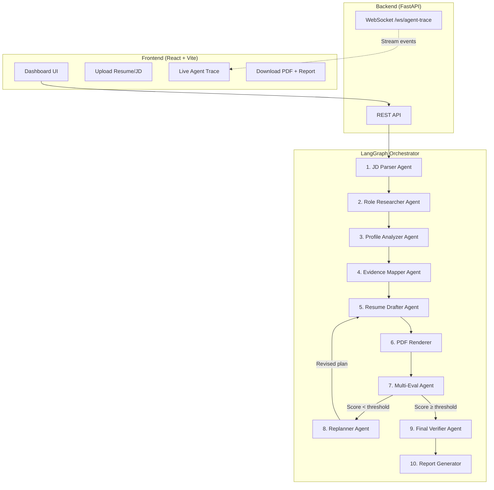
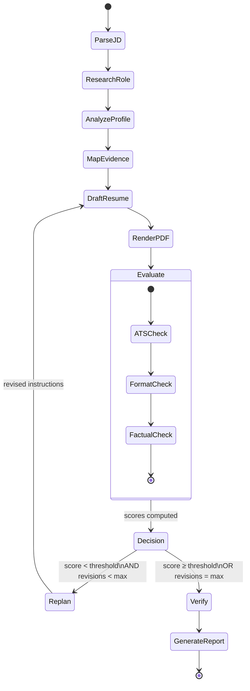

# Autonomous Resume & Application Agent — Implementation Plan

## Overview

An **agentic AI system** that autonomously takes a candidate's raw information + a target job description, then researches, drafts, evaluates, revises, and delivers a **truthful, ATS-optimized, role-tailored resume as PDF** — with full evidence traceability.

**Key differentiator for the hackathon**: A genuine **autonomous planning loop** powered by LangGraph's cyclic state machine — the agent **replans and self-corrects** based on evaluation feedback, not a fixed prompt chain.

---

## Architecture



---

## Agent Descriptions & Responsibilities

| # | Agent | Input | Output | LLM Tool Calls |
|---|-------|-------|--------|-----------------|
| 1 | **JD Parser** | Raw job description text | Structured JD: required skills, nice-to-haves, responsibilities, seniority level, company values | Groq LLM |
| 2 | **Role Researcher** | Parsed JD + company name | Industry context, salary range, common tech stacks, company culture notes | Web search tool (SerpAPI/Tavily) or supplied KB |
| 3 | **Profile Analyzer** | Candidate resume (PDF/text) + GitHub/portfolio links | Structured candidate profile: skills, projects, experience, education, certifications | Document parser + LLM |
| 4 | **Evidence Mapper** | Parsed JD + Candidate Profile | Relevance matrix mapping candidate evidence → JD requirements, gap analysis | LLM reasoning |
| 5 | **Resume Drafter** | Evidence map + replan instructions (if revision) | Tailored resume in structured JSON/Markdown | LLM generation |
| 6 | **PDF Renderer** | Resume content | Beautiful PDF resume | WeasyPrint (no LLM) |
| 7 | **Multi-Evaluator** | Rendered resume + JD | ATS score, formatting score, factual-consistency score, detailed feedback | 3 sub-evaluators via LLM |
| 8 | **Replanner** | Evaluation feedback + current resume | Specific revision instructions | LLM reasoning |
| 9 | **Final Verifier** | Final resume + original candidate data | Factual verification report (no fabrications) | LLM comparison |
| 10 | **Report Generator** | All agent outputs + revision history | Evidence/change report explaining edits | LLM summarization |

---

## Tech Stack

| Layer | Technology | Justification |
|-------|-----------|---------------|
| **Agent Orchestration** | LangGraph | Cyclic state machine, supports replanning loops, first-class streaming |
| **LLM (Primary)** | Groq (`llama-3.3-70b-versatile`) | Free, fast inference, large context |
| **LLM (Fallback)** | Google Gemini (`gemini-2.0-flash`) | Free tier, good fallback |
| **PDF Generation** | WeasyPrint | Pure Python, CSS-based layouts, professional output |
| **Backend** | FastAPI + WebSockets | Async, fast, real-time agent trace streaming |
| **Frontend** | React + Vite + vanilla CSS | Modern, fast, premium UI |
| **Resume Parsing** | PyMuPDF (fitz) | Extract text from uploaded PDFs |
| **Web Search** | Tavily API (free tier) or DuckDuckGo | Role/company research |
| **Document Store** | Local filesystem | Simple, no external DB needed |

---

## Project Structure

```
auto_resume_agent/
├── backend/
│   ├── main.py                    # FastAPI app entry
│   ├── config.py                  # Settings, API keys, model config
│   ├── api/
│   │   ├── __init__.py
│   │   ├── routes.py              # REST endpoints
│   │   └── websocket.py           # WebSocket for live agent trace
│   ├── agents/
│   │   ├── __init__.py
│   │   ├── state.py               # LangGraph shared state schema
│   │   ├── graph.py               # LangGraph workflow definition
│   │   ├── jd_parser.py           # Agent 1: JD Parser
│   │   ├── role_researcher.py     # Agent 2: Role Researcher
│   │   ├── profile_analyzer.py    # Agent 3: Profile Analyzer
│   │   ├── evidence_mapper.py     # Agent 4: Evidence Mapper
│   │   ├── resume_drafter.py      # Agent 5: Resume Drafter
│   │   ├── evaluator.py           # Agent 7: Multi-Evaluator
│   │   ├── replanner.py           # Agent 8: Replanner
│   │   ├── verifier.py            # Agent 9: Final Verifier
│   │   └── report_generator.py    # Agent 10: Report Generator
│   ├── tools/
│   │   ├── __init__.py
│   │   ├── pdf_renderer.py        # WeasyPrint PDF generation
│   │   ├── resume_parser.py       # Parse uploaded PDF/DOCX
│   │   ├── web_search.py          # Tavily/DuckDuckGo search
│   │   └── templates/
│   │       ├── modern.html        # Resume HTML template
│   │       ├── minimal.html       # Alternative template
│   │       └── styles.css         # Resume CSS styles
│   ├── models/
│   │   ├── __init__.py
│   │   └── schemas.py             # Pydantic models
│   └── data/
│       └── sample_candidate.json  # Demo candidate data
├── frontend/
│   ├── index.html
│   ├── package.json
│   ├── vite.config.js
│   ├── src/
│   │   ├── main.jsx
│   │   ├── App.jsx
│   │   ├── index.css              # Design system
│   │   ├── components/
│   │   │   ├── Header.jsx
│   │   │   ├── UploadPanel.jsx    # Upload resume + paste JD
│   │   │   ├── AgentTrace.jsx     # Live agent execution trace
│   │   │   ├── ScoreCard.jsx      # ATS/formatting/factual scores
│   │   │   ├── ResumePreview.jsx  # Embedded PDF preview
│   │   │   ├── EvidenceReport.jsx # Change/evidence report
│   │   │   └── StatusBadge.jsx    # Agent step status
│   │   └── utils/
│   │       └── api.js             # API client + WebSocket
│   └── public/
├── requirements.txt
├── .env.example
├── README.md
└── run.ps1                        # One-click start script
```

---

## Proposed Changes (Implementation Order)

### Phase 0: Project Setup
- Create Python venv, install all dependencies
- Initialize Vite React frontend
- Create `.env.example` with required keys

---

### Phase 1: Core Backend

#### [NEW] [config.py](file:///e:/AdityaPratapSingh/adi/Projects/auto_resume_agent/backend/config.py)
- Pydantic Settings class
- Groq API key, fallback provider key, model names
- Max revision cycles (default: 3), score thresholds

#### [NEW] [schemas.py](file:///e:/AdityaPratapSingh/adi/Projects/auto_resume_agent/backend/models/schemas.py)
- `ParsedJD`: required_skills, nice_to_haves, responsibilities, seniority, company_info
- `CandidateProfile`: name, contact, summary, skills, experience[], projects[], education[], certifications[]
- `EvidenceMap`: mapping of JD requirements → candidate evidence, gaps[]
- `ResumeContent`: sections with tailored content
- `EvaluationResult`: ats_score, formatting_score, factual_score, feedback[]
- `RevisionPlan`: specific changes to make
- `VerificationResult`: claims[], each with verified: bool, evidence_source
- `AgentState`: full LangGraph state including all above + revision_count, status

---

### Phase 2: LangGraph Agent Graph

#### [NEW] [state.py](file:///e:/AdityaPratapSingh/adi/Projects/auto_resume_agent/backend/agents/state.py)
- TypedDict for LangGraph state with all fields
- Reducers for list fields (append-only for trace/history)

#### [NEW] [graph.py](file:///e:/AdityaPratapSingh/adi/Projects/auto_resume_agent/backend/agents/graph.py)
- Define the LangGraph `StateGraph`
- Nodes: `parse_jd` → `research_role` → `analyze_profile` → `map_evidence` → `draft_resume` → `render_pdf` → `evaluate` → conditional edge → `replan` / `verify` → `generate_report`
- **Conditional edge**: If `eval_score < threshold AND revision_count < max_revisions` → route to `replan` node → back to `draft_resume` (THE KEY AGENTIC LOOP)
- **This cyclic graph is the core agentic behavior** — not a fixed chain

#### [NEW] Each agent file (jd_parser.py through report_generator.py)
Each agent follows the pattern:
```python
async def agent_node(state: AgentState) -> dict:
    # 1. Extract relevant inputs from state
    # 2. Construct structured prompt
    # 3. Call LLM (Groq primary, fallback to Gemini)
    # 4. Parse structured output (JSON mode)
    # 5. Emit trace event via callback
    # 6. Return state update dict
```

---

### Phase 3: Tools

#### [NEW] [pdf_renderer.py](file:///e:/AdityaPratapSingh/adi/Projects/auto_resume_agent/backend/tools/pdf_renderer.py)
- Jinja2 HTML template rendering
- WeasyPrint HTML→PDF conversion
- Multiple template styles (modern, minimal)
- Professional CSS: proper margins, typography, section headers

#### [NEW] [resume_parser.py](file:///e:/AdityaPratapSingh/adi/Projects/auto_resume_agent/backend/tools/resume_parser.py)
- PyMuPDF for PDF text extraction
- python-docx for DOCX support
- Structured text output

#### [NEW] [web_search.py](file:///e:/AdityaPratapSingh/adi/Projects/auto_resume_agent/backend/tools/web_search.py)
- DuckDuckGo search (no API key needed) as primary
- Tavily as optional upgrade
- Company info, role requirements, industry trends

---

### Phase 4: FastAPI Backend

#### [NEW] [main.py](file:///e:/AdityaPratapSingh/adi/Projects/auto_resume_agent/backend/main.py)
- FastAPI app with CORS
- Mount routes
- Startup/shutdown events

#### [NEW] [routes.py](file:///e:/AdityaPratapSingh/adi/Projects/auto_resume_agent/backend/api/routes.py)
- `POST /api/generate` — Accept candidate data + JD, start agent pipeline
- `GET /api/status/{job_id}` — Poll status
- `GET /api/download/{job_id}/resume` — Download generated PDF
- `GET /api/download/{job_id}/report` — Download evidence report
- `POST /api/upload/resume` — Upload existing resume PDF

#### [NEW] [websocket.py](file:///e:/AdityaPratapSingh/adi/Projects/auto_resume_agent/backend/api/websocket.py)
- WebSocket endpoint `/ws/trace/{job_id}`
- Stream agent decisions, actions, intermediate results in real-time
- This is **critical for the demo** — shows the autonomous decision-making

---

### Phase 5: React Frontend

#### Premium Dashboard UI with:
- **Dark mode** glassmorphism design
- **Upload panel**: Drag-drop resume + paste JD
- **Live agent trace**: Real-time timeline showing each agent's Goal → Decision → Action → Result → Adaptation
- **Score cards**: ATS score, Formatting score, Factual Consistency score with animated circular gauges
- **Resume preview**: Embedded PDF viewer
- **Evidence report**: Collapsible sections showing why each edit was made
- **Revision history**: Timeline of drafts with diff highlights

---

### Phase 6: Demo Data & Polish

#### [NEW] [sample_candidate.json](file:///e:/AdityaPratapSingh/adi/Projects/auto_resume_agent/backend/data/sample_candidate.json)
- Rich demo candidate profile with projects, skills, experience
- Sample JD for a Software Engineer role

---

## The Agentic Loop (What Makes This Win)



**This loop demonstrates:**
1. **Goal** — Produce a strong, truthful, ATS-optimized resume
2. **Decision** — Evaluate current output against multiple criteria
3. **Action** — Draft/revise based on specific feedback
4. **Intermediate Result** — Scored resume with detailed feedback
5. **Adaptation** — Replan with targeted improvements when scores are low
6. **Final Outcome** — Verified resume + evidence report

---

## Guardrails

> [!CAUTION]
> **Fabrication Prevention** is the #1 guardrail
- Every claim in the resume is traced to specific candidate evidence
- The `Evidence Mapper` creates explicit links: claim → source
- The `Final Verifier` cross-checks every bullet point against original data
- If a claim cannot be verified, it is **flagged and removed**
- The evidence report shows the full audit trail

---

## Verification Plan

### Automated Tests
- `python -m pytest tests/` — Unit tests for each agent, parser, renderer
- PDF output validation (page count, text extraction check)
- Factual consistency check on generated vs. input data

### Manual Verification
- Run full pipeline with sample data
- Verify PDF renders correctly
- Verify agent trace shows in real-time via WebSocket
- Verify revision loop triggers when ATS score is low
- Verify no fabricated content in output

### Security
- API keys loaded from environment variables only, never hardcoded
- File uploads validated (PDF/DOCX only, size-limited)
- FastAPI server listens on `127.0.0.1` for local development
- No user authentication needed (local tool), but CORS restricted
- TODO(security): Add rate limiting for production deployment

---

## Open Questions

> [!IMPORTANT]
> 1. **Do you have a Groq API key ready?** (Free at console.groq.com)
> 2. **Do you want Tavily search** (free tier, needs API key) **or just DuckDuckGo** (no key)?
> 3. **Any specific resume template style preference** (modern/creative/minimal/ATS-friendly)?
